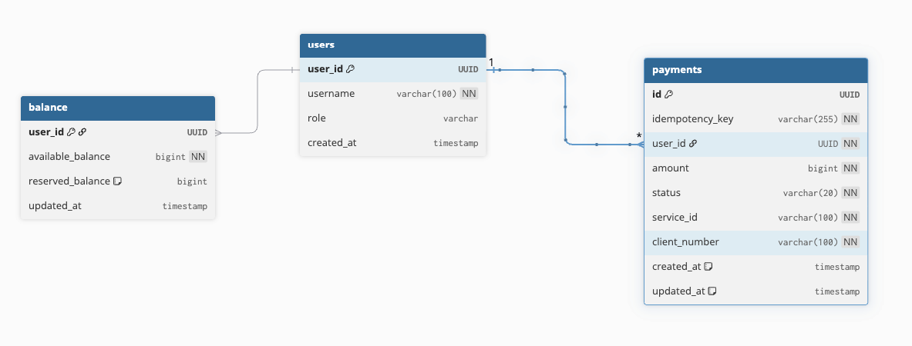
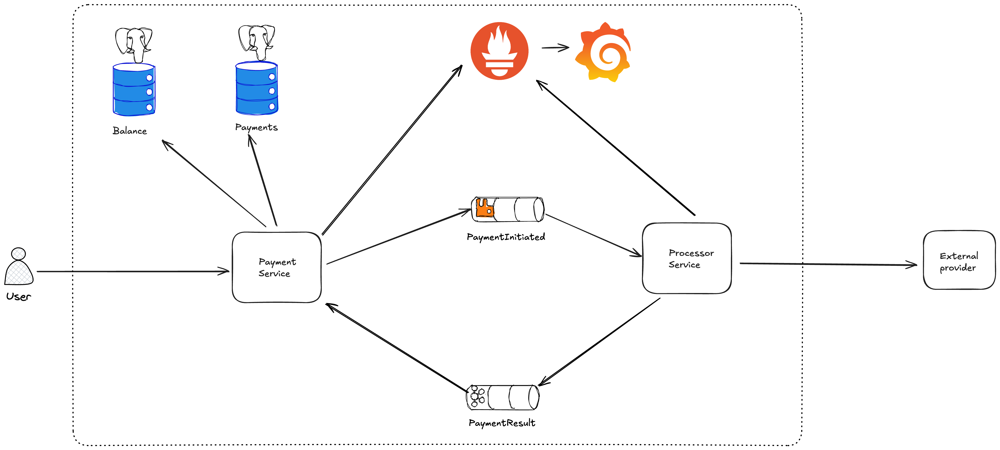
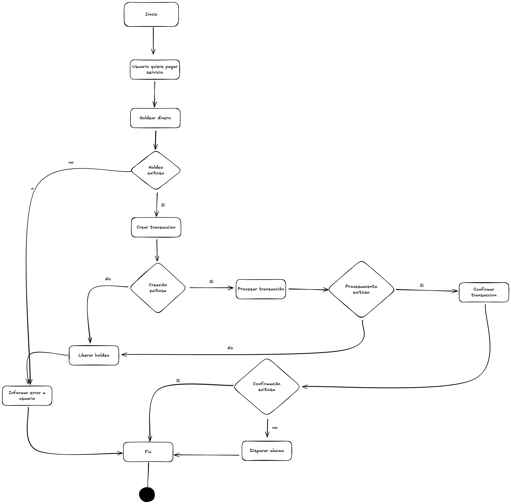
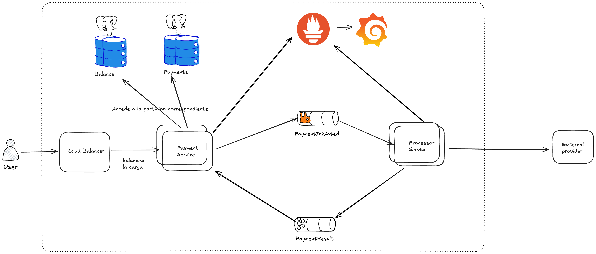
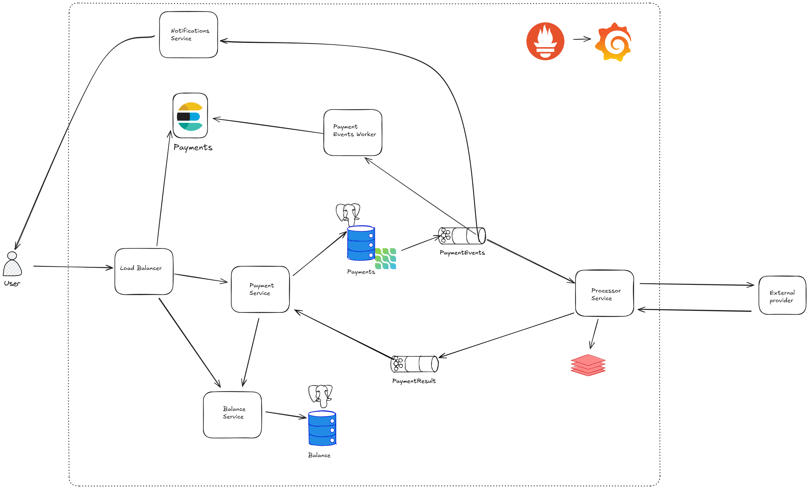

# Diseño

## Requisitos funcionales

- Un usuario debe poder pagar un servicio
- Un usuario debe poder ver su saldo disponible

## Requisitos no funcionales

- Alta disponibilidad con latencia mínima.
- El sistema debe poder ser escalable y eficiente.

## Assumptions

- La autenticación se realizará por algún third-party service, ej Auth0.
- El foco del sistema en una etapa inicial se centra en manejar correctamente la transacción de pago en lugar de aspirar a un alto rendimiento, es decir, la clave del sistema estará en no procesar pagos por duplicado ni dejar transacciones inconsistentes
- Solo se diseña el "pay-in" flow
    - Se deja de lado la conciliación con el proveedor externo
- Se asume un único currency
- Se asume que existe un repositorio de usuarios
- Se asume que existe un repositorio de entidades de pago habilitadas


## Estimaciones

- TPD (transactions per day): 1 millón
- RPS (request per second): **1M/(24h * 3600s) = ~10**.
- Tamaño promedio de un pago: 250 bytes
- Storage por día: **1M * 250 bytes = ~240MB/día**

## Elección de la base de datos

Para un primer diseño, debido a la características de los datos y las relaciones que presentan entre sí, consideraremos **PostgreSQL**.

## Modelo de datos



## Diseño inicial



- Inicialmente se proponen los siguientes componentes
  - Payment-Wallet-Service: 
    - Este servicio es el encargado de gestionar el balance del usuario y las transacciones. Se encarga de congelar el saldo comprometido durante el ciclo de vida de la transacción,
      crear la transacción y publicar un evento. Se encarga tambien de escuchar eventos de resultado de las operaciones para aplicar un estado final a una transacción  e imputar el balance correspondiente.
  - Payment-Processor-Service: 
    - Este servicio es el encargado de procesar los pagos iniciados, comunicarse con las pasarelas de pago externas
      y procesar las respuestas de las mismas. Cuando obtiene respuesta de la pasarela externa, publica un evento
      con el resultado de dicha operación, que será procesado por el servicio payment-wallet
  - Ambos servicios pushearán métricas a Prometheus y serán visualizadas en Grafana, que lo tendrá configurado como datasource
  - Payment-Wallet al crear el pago, publica el evento en una queue de RabbitMQ
  - Payment-Processor recibe el mensaje y procesa contra la pasarela de pago, de forma síncrona se entera del estado del pago y publica en un tópico de kafka
  - Payment-Wallet procesará el mensaje del tópico de Kafka y finalizará la transacción, con el estado correspondiente informado por payment-processor

## Diagrama de flujo de eventos



## API

- `POST /payments`
    - Crea un nuevo pago
    - Request
      - Header: 
        ```json
        X-User-ID: a1b2c3d4-e5f6-7890-abcd-1234567890ee
      - Body
        ```json
        {
          "client_number": "987654321",
          "service_id": "a1b2c3d4-e5f6-7890-abcd-1234567890ef",
          "amount": 15000,
          "idempotency_key": "unique-key-12345"
          }
    - Response
      - 201 Created

- `GET /health`
    - Retorna el estado del servidor.

## Especificacion de diseño de Eventos

- PaymentInitiated: Queue de rabbit, Payment-Wallet es el encargado de publicar en él mientras que Payment-Processor será el encargado de consumirlo.
  ```json
  "payload" : 
  {
    "user_id": "XXX",
    "client_number": "XXX",
    "service_id":"XXX",
    "amount": "1234",
    "transaction_id": "XXX"
  }

- PaymentResultTopic: Tópico de kafka con 4 particiones, Payment-Processor es el encargado de publicar en él mientras que Payment-Wallet será el encargado de consumirlo.  Se implementará un leader ack, el commit del lado del consumidor sera automático ya que el procesamiento de un evento duplicado será controlado con el estado
de la transacción en DB. Se optó por un tópico para hacer extensible el mensaje a múltiples consumidores como pueden ser un servicio de notificaciones, un servicio de analítica, un servicio de fraude, etc.


## Escalabilidad del diseño

A medida que nuestro negocio escala, es necesario implementar medidas para que nuestro sistema pueda soportar la carga.

Una primer medida puede ser agregar instancias de nuestro server y un load balancer para poder balancear la carga que tiene cada una de las mismas. Podría elegirse un algoritmo adaptativo para ajustarse a la carga actual, la capacidad del servidor, etc.

En cuanto a la base de datos, si bien podemos escalarla verticalmente, esto se volvería un límite eventualmente. Por eso, optaremos por escalar horizontalmente mediante la técnica de sharding, particionando la data en diferentes instancias. Para asignar a cuál instancia se guardaría un nuevo dato, podríamos usar consistent hashing para tomar la decisión.

Nuestro diseño inicial quedaría de la siguiente manera:



Si quisieramos escalar aún más, llevando el análisis un poco más cerca del mundo real, podríamos sacar las siguientes conclusiones:

- Partir nuestro monolito modular en diferentes microservicios. Esto permitiría usar distintas bases de datos según el caso de uso. Deberíamos primero definir los boundaries de cada dominio. Una opción sería:
    - **Payments Service**: se encarga de dar del dominio de pagos (alta y confirmación).
    - **Balance Service**: se encarga de la gestion de un usuario, efectua las operaciones de holdeo, débito y crédito en el saldo del usuario
    - **Processor Service**: se encarga de la comunicación con las pasarelas de pago.

- Se podría implementar un servicio de caché como redis para almacenar temporalmente los id de transacción que se procesen y reducir casi a cero la posibilidad de imputar pagos duplicados (siempre que la pasarela de pago no maneje idempotencia)
- Se podría implementar el patrón CQRS de forma de separar las escrituras de las lecturas, implementando una base de datos de tipo full text search aprovechando las bondades de la misma a la hora de presentar los pagos al usuario.
- Se podría implementar el patron SAGA con coreografía, usando eventos apoyados en el patron CDC para poder orquestar la transacción.
- Se podría implementar un sistema de notificaciones al usuario, a fin de notificarle el estado de los pagos realizados.

Podemos bocetar un diagrama simplificado del diseño final de la siguiente manera:



Una explicación sencilla podría ser:

- **Creación de un pago**
    - Se crea un nuevo pago en postgresql.
    - Se invoca al servicio de balance para holdear el saldo
    - Se actualiza el estado en la DB de la transacción a Autorizada
    - Se publica un nuevo mensaje notificando el evento en Kafka
    - El mensaje es recibido por el payment processor que procesa contra el proveedor.
    - Se informa el resultado en Kafka
    - Se actualiza el estado de la DB
    - Se publica un nuevo mensaje notificando el evento en Kafka, lo que dispara notificaciones al usuario y persistencia en elasticsearch

**Se mantienen en el diagrama tanto prometheus como grafana para observabilidad, no se agregan flechas para no complejizarlo**